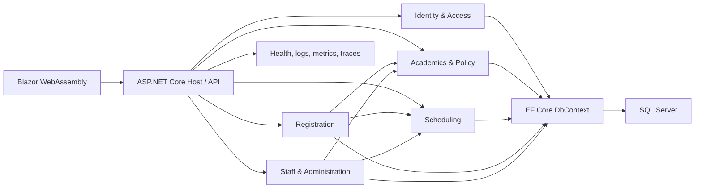
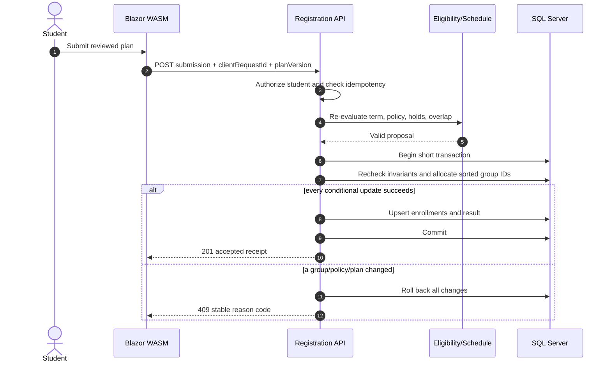
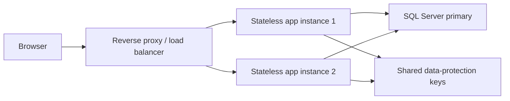

# Architecture and Engineering Principles

## Decision

Use a modular monolith on .NET 10 LTS:

- Blazor WebAssembly client.
- Same-origin ASP.NET Core REST API/host.
- ASP.NET Core Identity and server-side authorization.
- EF Core 10 and LINQ with a single RegistrationDbContext.
- SQL Server using Code First migrations.
- One deployable application plus one relational database initially.

This is the simplest design that preserves ACID registration and clear future
extension seams.



## Module boundaries

| Module | Owns |
|---|---|
| IdentityAccess | Accounts, activation, credentials, roles, sessions, authorization policies |
| Academics | Students, programs, curricula, catalogue, transcript, GPA, standing, holds, policy evaluation |
| Scheduling | Terms, windows, offerings, groups, rooms, staff assignment/availability, meeting slots |
| Registration | Plans, eligibility orchestration, optimizer, submissions, enrollments, capacity allocation |
| StaffAdministration | Role-scoped staff queries, admin commands, imports, audit and operational reports |

SQL schemas make ownership visible: auth, academics, scheduling, registration,
and audit. Registration may use public Academics and Scheduling interfaces,
but it may not reach into their internal handlers.

## Proposed solution shape

```text
src/
  StudentRegistration.Client/
  StudentRegistration.Api/
  StudentRegistration.Contracts/
  StudentRegistration.IdentityAccess/
  StudentRegistration.Academics/
  StudentRegistration.Scheduling/
  StudentRegistration.Registration/
  StudentRegistration.Infrastructure.SqlServer/
tests/
  StudentRegistration.UnitTests/
  StudentRegistration.IntegrationTests/
  StudentRegistration.ArchitectureTests/
  StudentRegistration.EndToEndTests/
docs/
  adr/
  diagrams/
ops/
```

Use a project per meaningful business module, not a project per entity or
architectural layer. Within a module, Domain, Application, and Endpoints may be
folders. Infrastructure implements narrow ports and owns the single DbContext
and migrations.

## Engineering principles

| Principle | Project application |
|---|---|
| KISS | One deployable and database; explicit services; no distributed workflow |
| YAGNI | No broker, generic rules DSL, solver platform, or microservices until measured need |
| SOLID / dependency inversion | Application services depend on narrow policy/schedule/commit interfaces |
| Separation of concerns | UI presents decisions; API authorizes; domain evaluates; SQL enforces invariants |
| DRY with restraint | Share stable value objects/DTO conventions, not speculative frameworks |
| Encapsulation | Modules expose use-case interfaces, not their EF entities |
| Server authority / zero trust client | Recheck role, ownership, time, term, policy, overlap, and capacity |
| Fail safe | Unknown policy or stale data blocks commit with an explainable code |
| Idempotency | A repeated client request returns the original registration result |
| Transactional consistency | Capacity and enrollments change in one short SQL transaction |
| Accessibility by default | UI components encode labels, focus, error, non-color, and list alternatives |
| Testability | TimeProvider, deterministic optimizer, explicit rules, real-SQL integration tests |
| Observability | Correlation IDs, safe structured logs, metrics and traces on critical paths |

Avoid generic repository and unit-of-work wrappers over EF Core. They hide LINQ
and transaction behavior without creating a useful boundary. API contracts are
DTOs and never expose EF entities. Reads use projection and AsNoTracking.

## Identity and security

- Student routes: /student/login and /student/activate.
- Shared staff route: /staff/login; no role selector.
- One identity system with Student, Admin, Lecturer, and TeachingAssistant
  claims/roles.
- Student activation only claims a pre-imported institutional record after a
  verified university channel or activation code.
- Staff accounts are provisioned, not publicly registered; staff MFA is
  required before production.
- Same-origin HttpOnly, Secure, SameSite cookie; antiforgery on state changes.
- Do not store long-lived bearer tokens in browser local storage.
- API authorization and ownership checks are mandatory because client-side
  Blazor checks can be modified.
- Replicas share ASP.NET Core Data Protection keys.
- Rate-limit login, optimizer, and registration endpoints using measured
  production thresholds.

## Time and academic context

- Inject TimeProvider; the server clock is authoritative.
- Store instants in UTC datetime2 and display the configured IANA timezone,
  initially Africa/Cairo.
- Store recurring timetable values as DayOfWeek plus TimeOnly.
- Resolve current teaching term separately from permitted registration term.
- Term lifecycle: Draft, RegistrationOpen, RegistrationClosed, Teaching,
  Completed, Archived.
- Every command includes a term ID; the server verifies that the term and
  registration window are currently permitted.

## Policy model

Use readable typed C# rules backed by effective-dated values:

- TermOpenRule
- StudentActiveRule
- NoBlockingHoldRule
- CurriculumRule
- PrerequisiteRule
- GpaAndStandingRule
- EarnedCreditsRule
- RepeatCourseRule
- CreditLoadRule
- ConflictRule

Every rule returns a stable reason code, plain-language explanation, source,
policy version, inputs used, and whether an approved override path exists.
Introduce a new rule class for genuinely new behavior; do not interpret user
authored scripts.

## Schedule validation and optimizer

Publishing a group validates Lecturer/TA availability, staff overlap, room
overlap, room capacity, term/campus slots, and required teaching roles.

The student optimizer chooses among published groups only. It does not move
official classes, rooms, Lecturers, or TAs.

Hard constraints:

- Exactly one group for each selected course.
- No meeting overlap: a.start < b.end and b.start < a.end.
- Published group with complete staff/room assignment.
- Eligibility and credit rules pass.
- Optional configured travel buffer across locations.

Algorithm:

1. Load viable groups for each course.
2. Order courses by fewest candidates.
3. Backtrack and prune on the first hard violation.
4. Score feasible schedules by fewer gaps, campus changes, preferred times,
   and balanced days.
5. Return the best three plus score explanations.
6. Stop at a configured time budget and return a clear partial/no-solution
   diagnostic.

This is deterministic, small, and testable for a typical 6-8 course plan.
Adopt OR-Tools or extract a compute service only when benchmarks prove the
simple search cannot meet the approved budget.

## Race-condition-safe registration

Never read a seat count and then insert based on the stale value. The critical
transaction uses a conditional atomic update:

```sql
UPDATE scheduling.SectionGroups
SET EnrolledCount = EnrolledCount + 1
WHERE Id = @GroupId
  AND Status = 'Published'
  AND EnrolledCount < Capacity;
```

The affected-row count decides whether the seat was obtained.



Submission steps:

1. Resolve student from server identity.
2. Return the stored result for an existing student/term/clientRequestId.
3. Re-evaluate policy and conflict state.
4. Start a short transaction using EF Core execution strategy.
5. Recheck window, policy version, hold, duplicates, and overlaps.
6. Sort group IDs to reduce deadlock cycles.
7. Execute conditional updates; any zero-row update rolls back all.
8. Write enrollments, decision snapshot, submission result, and audit event.
9. Commit and return the accepted timetable.

Unique indexes prevent duplicate active enrollment. SQL rowversion handles
ordinary concurrent editing, but it is not the sole capacity guard. Drops
transition enrollment and decrement the same group counter transactionally.
Capacity may not be reduced below EnrolledCount.

A reconciliation metric compares EnrolledCount with active Enrollment rows.
Any mismatch is a high-priority operational alert.

## Scaling without premature distribution



- Keep application nodes stateless; plans and submissions live in SQL.
- Serve fingerprinted WASM assets through compression and later a CDN.
- Use async I/O, connection pooling, pagination, projected LINQ, and indexes.
- Cache stable catalogue/policy reads with short TTL only after measurement.
- Never use cache/read replicas for final capacity, uniqueness, or eligibility.
- Observe optimizer duration, group lock waits, deadlocks, capacity conflicts,
  SQL latency, and rejection reasons.

Evidence-triggered evolution:

- Add distributed cache if indexed catalogue reads remain a material cost.
- Add reporting replica if reporting affects the primary.
- Extract optimizer if it needs independent CPU scaling.
- Add outbox/broker when the first durable external consumer exists.
- Extract Registration only when independent deployment is required and an
  atomic boundary strategy has been approved.
- Add a reservation/queue model only if measured hot-group contention makes
  synchronous first-commit-wins unacceptable.

## Rejected initial complexity

| Rejected item | Reason |
|---|---|
| Microservices | Adds network consistency and operations cost before independent deployment need |
| Event sourcing / full CQRS | No replay/audit requirement that outweighs complexity |
| Generic repository | Obscures EF Core and LINQ behavior |
| Dynamic policy DSL | Security, validation, and debugging cost; typed rules suffice |
| Message broker | No durable external consumer in MVP |
| Institution-wide solver | Student requirement only needs published-group combinations |
| Distributed lock | SQL row is the correct total-order point for a scarce seat |
| Kubernetes | Two stateless instances can run on simpler hosting |

## Validation

- Architecture tests reject module cycles and forbidden references.
- Unit tests cover every policy reason and optimizer boundary.
- Integration tests use real SQL Server, EF migrations, constraints, and
  parallel transactions.
- E2E tests verify role scope, student journey, conflict UI, and stale states.
- k6 tests target/2x/spike traffic.
- Accessibility automation plus keyboard and screen-reader UAT.
- Backup/restore and migration rollback are rehearsed before Gate D.
