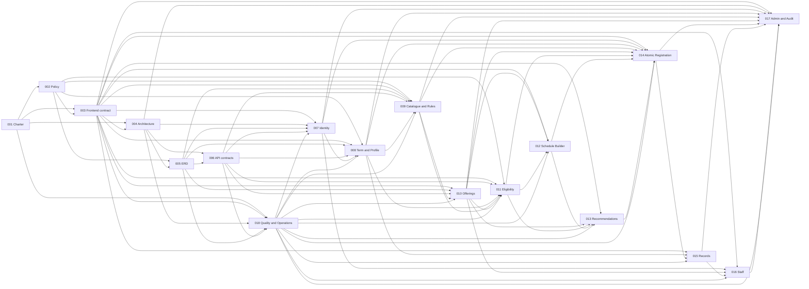
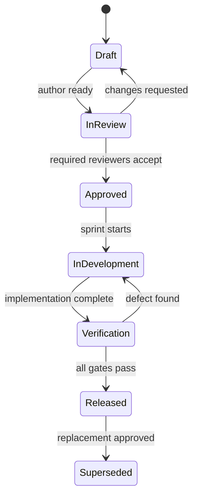

# Project Plan

**Owner-approved policy amendment (2026-07-20):** Ahmed ELbamby's explicit
instruction approves the three-credit roadmap, first-term automatic
registration, term-2-or-later approval-held self-registration, bounded
CGPA-qualified overload, and privacy-safe held-capacity rules recorded below.

## 1. Product goal

Deliver a simple, accessible, secure registration system in which:

- A student activates an institutional account, signs in with University ID
  and password, sees the server date and current academic context, discovers
  eligible subjects, selects groups, resolves schedule conflicts, and submits
  one atomic registration from recommended term 2 onward. Matching-cohort
  recommended-term-1 subjects are registered automatically.
- Admin, Lecturer, and Teaching Assistant use one shared password-only demo
  staff login with no MFA/2FA. The server derives roles and data scope; a login
  form never lets a user claim a role.
- Admin publishes valid terms, policies, offerings, groups, staff assignments,
  rooms, times, and capacities.
- Lecturers and TAs see only their assignments, timetable, authorized rosters,
  and availability.
- Staff own availability edits. Admin may view/import availability but has no
  correction or override command in the POC.

Success means zero overbooked groups, zero partial submissions, every policy
decision is explainable, and future features can attach at stable module
boundaries.

## 2. Scope

### MVP

- Institutional student activation and two login experiences.
- Isolated migration-first Development and per-run Testing databases populated
  with wholly synthetic student profiles, generated unique University IDs,
  generated PIN/passwords, and password-hash-only SQL persistence.
- Role-based access for Student, Admin, Lecturer, and Teaching Assistant.
- Server-authoritative time, institutional timezone, academic term, and
  registration windows.
- Student academic profile, GPA, standing, transcript, prerequisites, holds,
  cohort, program, and earned credits.
- Effective-dated AASTMT policy configuration with rule provenance.
- A simple `DEMO-POC-2026.1` policy profile: every demo subject is exactly
  three credits; `CurriculumCourse` is the programme/cohort roadmap;
  recommended-term-1 roots have no prerequisite and every later roadmap
  subject has at least one prerequisite; matching-cohort term-1 registration
  is automatic and students self-register from term 2 onward; 18 credits is
  the normal maximum, while 19-21 credits requires CGPA at least 3.0 and a
  per-subject approval; plans above 21 credits fail; prerequisites, capacity,
  and overlap remain hard checks; no travel buffer, generic advisor,
  prerequisite-waiver, drop, or withdrawal flow exists.
- A self-registration request holds each selected subject seat while its
  per-subject approval by an authorized Admin or group-assigned Lecturer/TA is
  pending. All required subject decisions aggregate to one plan decision; a
  hold ends when the plan is approved or rejected, or when the registration
  window closes. Capacity always satisfies
  enrolled plus held less than or equal to configured capacity, and Student,
  Admin, Lecturer, and Teaching Assistant views show total, enrolled, held,
  and available counts without exposing holder identity.
- The small curated, provenance-recorded AASTMT College of AI snapshot in
  [DEMO_CURRICULUM.md](DEMO_CURRICULUM.md), with clearly labeled synthetic gap
  rows, plus offerings, groups, capacities, lecturers, TAs, rooms, and meeting
  slots.
- Every open subject has a staffed Lecture and at least one staffed
  Tutorial/Section or Laboratory; each present Tutorial/Section and Laboratory
  activity has a TA.
- Explainable subject eligibility and search.
- Draft schedule, overlap detection, manual resolution, and up to three
  recommended group combinations.
- Atomic all-or-nothing submission with idempotency and race safety.
- Student receipt/history, staff workspaces, admin audit, and operations.

### Not in MVP

- Payments, grades entry, attendance capture, waitlists, generic advisor workflow,
  notifications, chat, mobile applications, multi-tenancy, AI/ML scheduling,
  and institution-wide timetable generation.
- A break-glass capacity or conflict override.
- Microservices, event sourcing, a message broker, a dynamic policy DSL,
  Kubernetes, or separate read/write databases.

## 3. Product and delivery roles

| Role | Accountability |
|---|---|
| Product Owner | Scope, ordering, success metrics, acceptance |
| AASTMT Registrar/Policy SME | Source authority, interpretation, examples, policy approval |
| UX Lead | Storyboard, prototype, usability, WCAG 2.2 AA |
| Technical Lead/Architect | Module boundaries, class/API contracts, ADRs |
| Data/Backend Lead | ERD, EF Core model, migrations, SQL concurrency |
| .NET Developers | Blazor WASM and ASP.NET Core implementation |
| QA/SDET | Acceptance, integration, concurrency, load, E2E, accessibility |
| DevOps | CI/CD, configuration, observability, backup, rollback |
| Security Reviewer | Authentication, authorization, privacy, abuse controls |

One person may fill multiple roles on a small team, but accountabilities and
approval gates remain distinct.

For this non-production design-capability demo, Ahmed ELbamby is the sole
developer and sole human approval authority. He fulfills every accountability
in the table as a distinct review perspective. No additional person or
institutional sign-off is required to approve demo implementation, and demo
approval is not represented as official AASTMT production authorization.

## 4. Exact specification inventory

There are exactly 18 living specifications.

**Gate A status:** APPROVED by Ahmed ELbamby on 13 July 2026 for
non-production demo implementation. Gate B-D and production release approval
remain separate.

| ID | Name | Accountable owner | Primary focus | First target |
|---|---|---|---|---|
| SPEC-001 | Product Charter and RBAC | Product Owner | Vision, personas, scope, permission matrix, metrics | S0 |
| SPEC-002 | AASTMT Policy Rulebook | Registrar/Policy SME | Sources, simplified rules, versions, open policy decisions | S0 |
| SPEC-003 | Frontend Page Design, Storyboard, Accessibility and Functional Testing | UX Lead | 27 page designs, design system, component/contract/E2E/visual/a11y tests | S0 |
| SPEC-004 | Architecture and Engineering Principles | Architect | Modular monolith, dependencies, deployment, extension strategy | S0 |
| SPEC-005 | ERD and Data Lifecycle | Data Lead | Entities, ownership, constraints, indexes, audit, migrations | S0-S1 |
| SPEC-006 | Domain Classes and API Contracts | Technical Lead | Aggregates, services, DTOs, endpoints, error model | S0-S1 |
| SPEC-007 | Identity and Account Lifecycle | Security Lead | Generated demo identities, activation, password-only login, recovery, RBAC, lockout, sessions | S1 |
| SPEC-008 | Academic Term and Student Profile | Backend Lead | Time, terms/windows, GPA, transcript, standing, holds | S1 |
| SPEC-009 | Catalogue, Prerequisites, and Policy Admin | Policy SME + Backend | Courses, curricula, typed rules, validation, simulation | S2 |
| SPEC-010 | Offerings, Groups, and Resources | Backend Lead | Groups, capacity, staff, rooms, times, publish validation | S2 |
| SPEC-011 | Eligibility and Subject Discovery | Product Owner | Search, availability, rule evaluation and explanations | S3 |
| SPEC-012 | Schedule Builder and Conflicts | Technical Lead | Draft timetable, overlap detection, manual resolution | S4 |
| SPEC-013 | Schedule Recommendations | Technical Lead | Bounded deterministic search, scoring, alternatives | S5 |
| SPEC-014 | Registration Capacity and Concurrency | Data/Backend Lead | Atomic commit, idempotency, constraints, race safety | S6 |
| SPEC-015 | Student Registration Records | Product Owner | Receipt, current timetable, history, decision snapshot | S6 |
| SPEC-016 | Lecturer and TA Workspace | Product Owner | Assignments, scoped roster, timetable, availability | S7 |
| SPEC-017 | Admin Operations, Audit, and Reporting | Product Owner | Delegated master-data commands, monitoring, audit, exports, invariant safeguards | S2-S7 |
| SPEC-018 | Quality, Security, Scalability, and Operations | QA/DevOps/Security | SLOs, threat model, test gates, recovery, release | S0-S8 |

## 5. Dependencies

## 6. Agile framework

### Cadence

- Two-week sprints.
- Planning commits at 80-85% of adjusted team capacity.
- Daily 15-minute stand-up.
- Weekly backlog refinement plus policy/UX clinic.
- Mid-sprint risk and test review for scheduling and registration work.
- End-of-sprint staging demo, acceptance, and retrospective.
- Capacity is re-baselined after three measured sprints.

### Spec and change workflow

- Every backlog item links to a spec and acceptance criterion, for example
  SPEC-014/AC-07.
- Behavior changes begin with a spec pull request.
- A policy change requires an effective-dated version and Registrar/SME
  approval.
- An architectural change requires an ADR and Technical Lead approval.
- A data/concurrency change requires Data Lead and QA approval.
- Released behavior is never silently rewritten; record the former version
  and migration effect.

### Definition of Ready

A story may enter a sprint when:

- Persona, value, spec/criterion link, and explicit non-goals are present.
- It is INVEST-compliant and eight points or smaller.
- Happy, validation, failure, authorization, accessibility, stale, and
  performance behaviors are testable where relevant.
- UI designs include loading, empty, success, error, denied, and concurrent
  change states.
- Data, API, migration, policy source, dependencies, and test data are known.
- No unresolved question can materially alter implementation.
- Product, development, and QA agree it is estimable.

### Definition of Done

- Peer-reviewed implementation satisfies every linked criterion.
- Unit, SQL Server integration, architecture, Blazor E2E, and relevant
  concurrency/load tests pass.
- Server authorization and resource ownership are tested.
- Accessibility checks have no serious failures on changed critical flows.
- Logs, metrics, user-safe errors, migration, backup, and rollback notes exist.
- Spec, diagram, ADR, and operations documentation are current.
- No unresolved critical/high security finding remains.
- Staging acceptance is complete; Registrar/SME also accepts policy behavior.

## 7. Sprint plan

| Sprint | Goal | Specifications | Demonstrable exit |
|---|---|---|---|
| S0 Discovery/design | Remove policy, UX, data, and architecture ambiguity | 001-006; 018 baseline | Completed: Gate A and all demo decisions approved 13 July 2026 |
| S1 Walking skeleton | Authenticate and show authoritative current context | 005-008 | Student and staff sign in; role route, date, and term display |
| S2 Admin master data | Configure and publish a registerable term | 009-010; 017 slice | Admin publishes a validated offering |
| S3 Explainable availability | Show correct available subjects | 011 | Student sees eligible/unavailable subjects and reasons |
| S4 Conflict-safe builder | Detect and manually resolve overlaps | 012 | Valid draft progresses; unresolved conflict blocks |
| S5 Recommendations | Offer feasible group alternatives | 013 | Up to three explained options or honest no-solution |
| S6 Safe registration | Commit atomically under contention | 014-015 | Exactly one winner for one remaining seat; no partial state |
| S7 Role workspaces | Complete staff and admin operations | 016-017 | Scoped staff data and auditable operations |
| S8 Hardening/release | Prove production readiness | 018 | Gate D UAT, security, load, accessibility, and recovery pass |

Each demonstrable slice applies the migration declared in
`.specify/persistence-manifest.json` before its end-to-end SQL tests: S1 creates
the Identity/Academic foundation; S2 adds catalogue/scheduling; S4 adds
discovery/plan persistence; S6 adds registration/receipt persistence; S7 adds
staff-admin/export persistence. Every migration has one owner/test/delivery
task, updates the shared EF snapshot in dependency order, and must pass fresh
database, prior-version upgrade, idempotent-script, rollback, and model-parity
checks. Production never auto-migrates on application startup.

Non-production data is not embedded in migrations. After migrations, an
explicit environment-guarded bootstrap composes SPEC-007 identity and SPEC-008
academic contributors for `StudentRegistration_Development` or an isolated
`StudentRegistration_Test_{runId}` database. Development credentials are
revealed once through a Git-ignored local artifact; tests receive credentials
in memory. Plaintext credentials never enter SQL, source, logs, or reports.
Per-run Testing databases are disposed after use; Development state persists
until an explicit guarded reset. Git-ignored credentials, logs, and exports
expire within seven days.

## 8. Approved demo non-functional targets

These values are approved POC engineering targets, not production sizing,
availability commitments, or an AASTMT SLA.

| Area | Initial target |
|---|---|
| Population | 25,000 accounts; 5,000 concurrent authenticated sessions |
| Registration load | 75 submissions/s for 10 min; 200/s for 60 s |
| Read load | 300 catalogue/timetable requests/s |
| Catalogue latency | p95 <= 300 ms |
| Submission latency | p95 <= 2 s at target load |
| Optimizer | p95 <= 500 ms for 8 courses, up to 10 groups each |
| Correctness | Zero overbooking, duplicate active course enrollment, partial submission |
| Availability | 99.9% during announced registration windows |
| Recovery | RPO <= 5 min; RTO <= 1 hour |
| Accessibility | WCAG 2.2 AA on critical flows |

The approved POC platform is SQL Server 2022 Developer at compatibility level
160 through Docker/Testcontainers. Browser gates cover current stable Chrome,
Edge, and Firefox plus Playwright WebKit; actual Safari/macOS is future
production-readiness scope. Secrets use User Secrets/environment variables,
and two-replica tests share SQL-backed Data Protection keys protected by a
generated local certificate outside Git.

Blocking POC tests run the target mix for 10 minutes (75 submissions/s plus
300 reads/s) and a 60-second spike at 200 registration submissions/s across at
least two stateless replicas. Reads are 50% offering discovery, 25%
eligibility detail, 15% plan/timetable, and 10% registration records;
submissions are 70% valid unique, 20% expected business rejection, and 10%
same-key replay. Existing 2x, 5x, and 120-minute soak profiles may run as
non-blocking diagnostics and cannot relax correctness. A mandatory collision
test submits 100 registrations to a 30-seat group and must produce exactly 30
active enrollments.

## 9. Risks

| Risk | Owner | Mitigation / gate |
|---|---|---|
| Policy ambiguity or change | Registrar/PO | Versioned sources, examples, SME approval before SPEC-009 |
| Optimizer scope expansion | PO/Architect | Only published-group combinations in MVP |
| Seat oversubscription | Data/QA | Atomic SQL update, transaction, unique constraints, collision tests |
| Client bypass of rules | Security/Backend | Revalidate all rules and ownership on server |
| Incorrect time/term | Backend/QA | TimeProvider, UTC instants, configured timezone, boundary tests |
| Bad catalogue data | Registrar/Admin | Import preview, provenance, validation, publish gate |
| Peak performance | DevOps/QA | Confirm forecast, indexes, load test, observe p95 and lock waits |
| Stale WASM state | Frontend/Backend | Version tokens and final server revalidation |
| Sensitive-data exposure | Security | Least privilege, scoped queries, audit, safe logs |
| Inaccessible calendar | UX/QA | Equivalent chronological table/list and assistive-tech UAT |
| Scope growth | PO | Fixed non-goals and separately versioned future backlog |

## 10. Release gates

- Gate A, end S0: Ahmed ELbamby approves the planning contracts after recording
  Product Owner, Registrar/SME, UX, Architect, Data Lead, Security, and QA
  review perspectives. **Completed 13 July 2026.**
- Gate B, end S2: secure walking skeleton and valid published master data.
- Gate C, end S6: end-to-end beta with proven atomic seat allocation.
- Gate D, end S8: UAT, accessibility, security, load, recovery, and release
  approvals.
