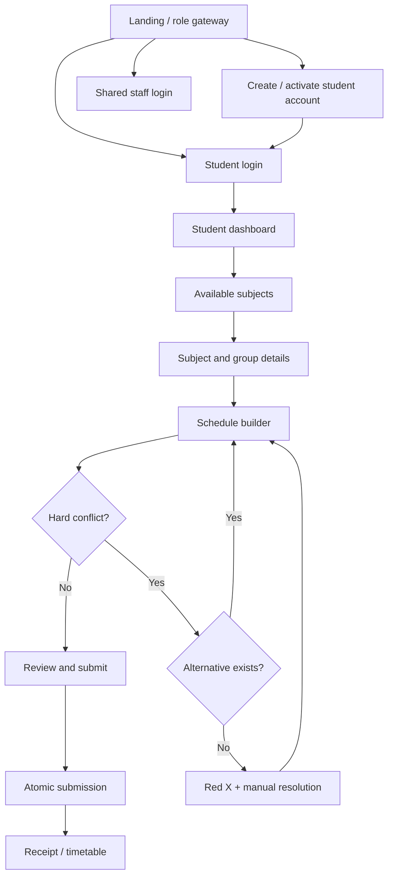
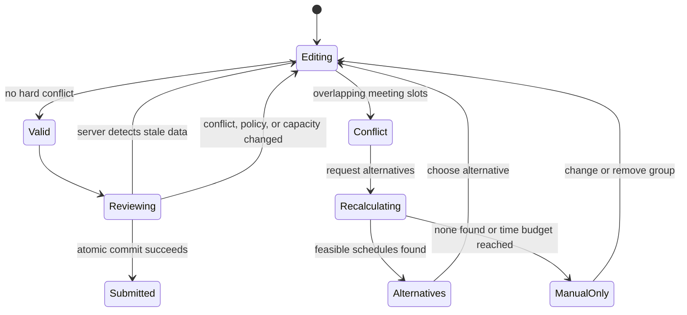

# Screen Storyboard

## Audience and UX goals

The interface serves students under peak-time pressure, staff with different
data scopes, and administrators managing complex master data. It must remain
clear on mobile and desktop, work without color perception, support keyboard
and assistive technology, and never hide the reason a submission is blocked.

There are 27 reusable route-level screen templates: 5 public/authentication,
8 student, 9 admin, 4 shared Lecturer/TA, and 1 system screen.

Before implementation, each route requires the Page Design Record defined by
SPEC-003: annotated wide/narrow wireframes, information hierarchy, components,
data/reason-code mapping, action/navigation contract, focus order, complete
state matrix, responsive behavior, and component/contract/E2E/a11y/visual test
IDs. The normative route-to-owner/test matrix is
specs/003-ux-storyboard-accessibility/page-matrix.md.

## Primary journey

## Shared shell

Every authenticated page shows:

- Server-derived date/time with the configured institutional timezone.
- Current teaching term, permitted registration term, and window status.
- User display name and server-authorized role context.
- Session-expiry warning and sign-out.
- Accessible help/reference ID for failures.

Every data screen implements loading, empty, success, validation error,
recoverable service error, unauthorized/session-expired, stale/concurrent
change, and offline states or records a justified N/A state. Editing screens
protect unsaved changes. Offline mode never queues a registration/admin write
or presents a cached success.

## Public and authentication screens

| ID / route | Story | Key states and behavior |
|---|---|---|
| AUTH-01 / | The visitor chooses Student or Staff and sees current system/window status. | Normal, maintenance, unavailable; links are named by destination. |
| AUTH-02 /student/login | A student enters University ID and password. | Generic invalid credentials, locked, rate-limited, expired session; labels, password reveal state, and error focus are accessible. |
| AUTH-03 /student/activate | A student verifies a pre-imported University ID and institutional activation factor, then creates a password. | Unknown/mismatch, already activated, expired token, weak password; no open self-created university identities. |
| AUTH-04 /staff/login | Admin, Lecturer, and TA use one login. The server derives roles and routes. | No role selector; invalid/disabled/no-role/MFA states never reveal account existence. |
| AUTH-05 /account/recovery | A user activates or resets a password through a verified institutional channel. | Sent, expired/used token, rate limit, success; focus moves to confirmation. |

## Student screens

| ID / route | Story | Information and transitions |
|---|---|---|
| STU-01 /student | Dashboard shows GPA, earned credits, standing, holds, current term/window, and registration summary. | Open/upcoming/closed/no term/hold/profile issue. Primary action starts or resumes a plan. |
| STU-02 /student/subjects | Default view lists eligible, available offerings; search/filter and an unavailable-with-reason view are available. | Announces result count; empty filters have a reset action; every eligibility state has icon and text. |
| STU-03 /student/subjects/{offeringId} | Subject details show credits, prerequisite result, Lecturer, TA, room, day/time, group capacity and state. | Open/nearly full/full/changed/unpublished/selected. Group cards have complete accessible names. |
| STU-04 /student/schedule | Calendar and equivalent chronological list show selected groups, conflicts, and up to three alternatives. | Valid/recalculating/warning/hard conflict/stale/full/no solution. Red X is paired with Conflict text and details. |
| STU-05 /student/review | Student reviews groups, credits, policy checks, terms, and final blocking reasons. | Submit is enabled only for a conflict-free, currently eligible plan; a disabled action always states why. |
| STU-06 /student/registration/result/{id} | Atomic result gives reference, term, groups, staff, rooms, timetable, and decision snapshot. | Success or rejection explicitly states that no partial registration occurred. |
| STU-07 /student/registrations | Student sees current timetable and historical terms in calendar and table/list formats. | Empty/current/history/unavailable; printable semantic table. |
| STU-08 /student/account | Read-only institutional identity plus permitted security/session actions. | Saved/validation/stale/password failure; sign-out-all requires confirmation. |

## Admin screens

| ID / route | Story | Information and transitions |
|---|---|---|
| ADM-01 /admin | Dashboard shows active term, countdown, traffic, fill rates, failures, and data-quality warnings. | Metrics show timestamp and text equivalents; auto-refresh can pause. |
| ADM-02 /admin/terms | Admin creates terms, timezone, lifecycle, and one or more registration windows. | Prevent invalid dates, overlapping windows, or multiple active contexts. |
| ADM-03 /admin/users | Admin imports/provisions students and staff and assigns/revokes staff roles. | Preview, duplicates, row errors, disabled user; error export references source row. |
| ADM-04 /admin/students | Authorized admin inspects GPA, transcript, holds, and provenance and performs reasoned corrections. | Read-only source/stale version/invalid correction/required reason. |
| ADM-05 /admin/catalogue | Admin manages programs, curricula, courses, prerequisites, and effective-dated typed policy values. | Draft/published/superseded, prerequisite cycle, invalid range, policy simulation. |
| ADM-06 /admin/offerings | Admin creates offerings/groups, capacity, Lecturer/TA assignments, rooms and meeting slots, then validates/publishes. | Missing resource, staff/room overlap, capacity mismatch, stale edit; validation links to the field. |
| ADM-07 /admin/resources | Admin manages rooms, room capacity, meeting templates, and staff availability. | Imported/empty/unavailable/overlap; table/list editor is an alternative to timetable grid. |
| ADM-08 /admin/registrations | Admin monitors submissions/fill/failures and makes only approved, reasoned corrections. | Live/stale/degraded/collision/correction blocked. Normal workflow cannot exceed capacity or create conflict. |
| ADM-09 /admin/audit | Admin searches immutable audit events and produces authorized operational exports. | Empty/large result/export queued/ready/failed/restricted event. |

## Shared Lecturer and Teaching Assistant screens

Lecturer and TA use the same components. Server-side authorization changes
scope and available actions, not a client-selected role.

| ID / route | Story | Role scope |
|---|---|---|
| STF-01 /staff | Staff dashboard shows own role context, assignments, deadlines, and warnings. | Lecturer sees assigned lecture groups; TA sees assigned tutorial/lab groups. |
| STF-02 /staff/timetable | Staff sees assigned subject/group, colleagues, rooms, days, times, and history. | Direct URLs to unassigned data return 403. Calendar has table/list equivalent. |
| STF-03 /staff/groups/{groupId}/roster | Staff sees the minimum authorized roster and counts for an assigned group. | No unrelated students or groups; semantic table and accessible paging. |
| STF-04 /staff/availability | Staff records available/unavailable time ranges before the configured deadline. | Draft/saved/overlap/deadline passed/admin changed schedule/stale edit. Keyboard and text-range entry are supported. |

## System screen

| ID / route | Story | States |
|---|---|---|
| SYS-01 /status/{code} | Reusable safe error/status page. | 403, 404, session expired, maintenance, offline, and unexpected error with reference ID; never a raw stack trace. |

## Conflict storyboard

The conflict presentation contains:

- Red X icon with accessible name Conflict.
- Subject codes/names and every overlapping day/start/end.
- Explanation of why the current plan cannot be submitted.
- Compare/select actions for alternatives, if any.
- Direct links to change each conflicting group.
- A disabled submit action until final server validation succeeds.

## Accessibility acceptance baseline

- WCAG 2.2 AA, keyboard operation, skip link, visible focus, logical order.
- Text and icon accompany all color status.
- Normal-text contrast at least 4.5:1.
- Error summary links to fields; inline errors use programmatic association.
- Schedule calendar always has equivalent chronological list/table.
- Status changes use restrained live regions.
- Reflow at 400% zoom and usable layouts from 320 to 1920 CSS pixels.
- Reduced-motion preference and accessible session timeout warning.
- Localization-ready resources and layout; Arabic/RTL is a future spec.

## Usability validation

- S0: at least 8 students find term, eligible subject, group, and full status.
- S2: 3-5 admin/registrar users create a term and publish a valid offering.
- S5: at least 8 students identify, auto-resolve, and manually resolve conflicts.
- S7: at least 3 Lecturers and 3 TAs find assignment/roster and submit availability.
- S8: end-to-end UAT includes novice, keyboard-only, and screen-reader users.

Initial target is above 80% task completion and below 15% task errors. Go-live
target is at least 90% completion for registration across at least 8 students
including novice, keyboard-only, and screen-reader participants, plus at least
3 Admin, 3 Lecturer, and 3 TA participants for their critical journeys, with
no unresolved critical or major core-flow usability defect.
