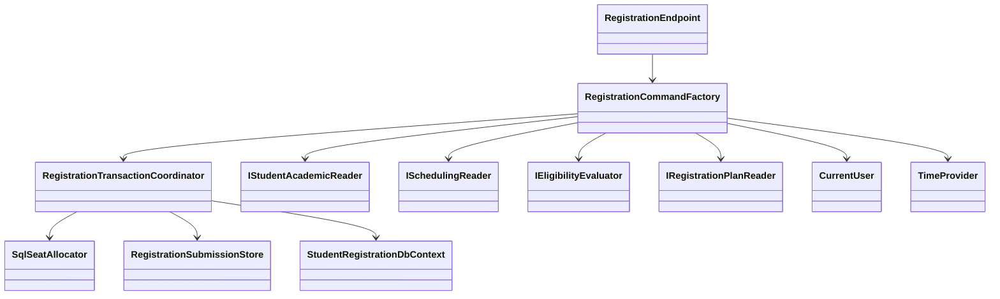
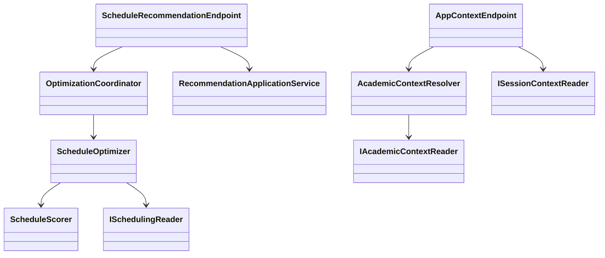
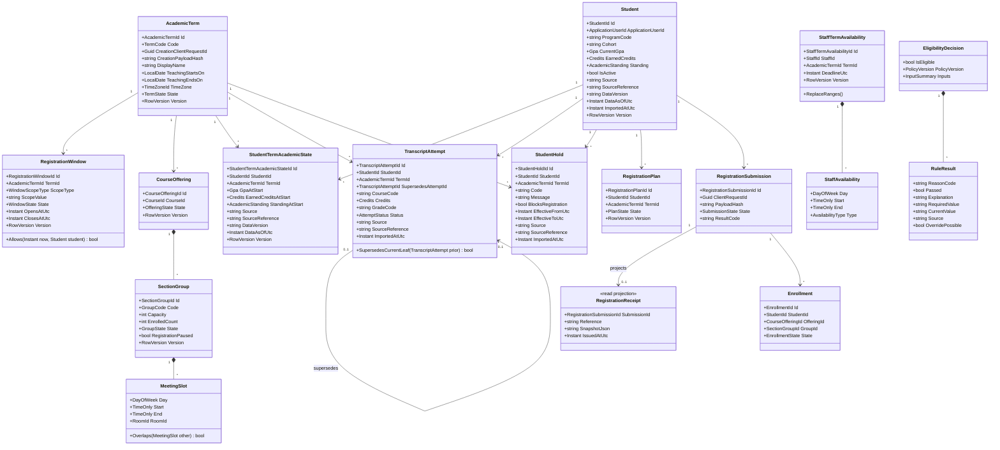
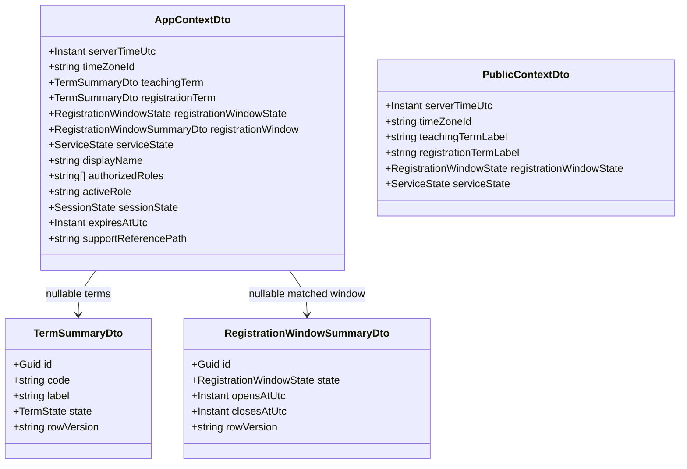

# Domain and Application Class Diagram

This system-wide class-level view shows the canonical use-case services,
transaction collaborators, module seams, and core registration model. Exact
fields remain in owner-spec contracts and the ERD; these panels are not an
instruction to create one project per architectural layer.

## Application orchestration





## System module services

```mermaid
classDiagram
  class StudentAuthenticationService
  class StudentActivationService
  class StaffAuthenticationService
  class DemoDatabaseInitializer
  class DemoIdentitySeedContributor
  class DemoStudentProfileSeedContributor
  class AdminUserLifecycleService
  class IAdminUserLifecycleCommands
  class AcademicContextResolver
  class RegistrationWindowService
  class CataloguePublicationService
  class PolicyAdministrationService
  class IPolicyEvaluator
  class OfferingPublicationService
  class ResourceAvailabilityService
  class ISchedulingReader
  class EligibilityService
  class RegistrationPlanService
  class ScheduleOptimizer
  class RegistrationTransactionCoordinator
  class RegistrationReceiptService
  class StaffWorkspaceQueries
  class AuditTransactionWriter
  class IAuditEventWriter
  class IAuditEventReader
  class IRegistrationSubmissionReader
  class IOperationalMetricsReader
  class AuditEventQueries
  class AuditExportService
  class AdminMetricsQuery
  class ObservabilityExtensions

  AdminUserLifecycleService ..|> IAdminUserLifecycleCommands
  DemoDatabaseInitializer --> DemoIdentitySeedContributor
  DemoDatabaseInitializer --> DemoStudentProfileSeedContributor
  AcademicContextResolver --> RegistrationWindowService
  EligibilityService --> IPolicyEvaluator
  EligibilityService --> ISchedulingReader
  RegistrationPlanService --> EligibilityService
  ScheduleOptimizer --> ISchedulingReader
  AuditTransactionWriter ..|> IAuditEventWriter
  RegistrationTransactionCoordinator --> IAuditEventWriter
  OfferingPublicationService --> IAuditEventWriter
  RegistrationReceiptService --> IRegistrationSubmissionReader
  StaffWorkspaceQueries --> ISchedulingReader
  AuditEventQueries --> IAuditEventReader
  AuditExportService --> AuditEventQueries
  AdminMetricsQuery --> IOperationalMetricsReader
```



## Core domain model



AcademicTerm creation replay is bound by globally unique
`CreationClientRequestId` plus `CreationPayloadHash`; it does not add an
idempotency entity. Transcript supersession is filtered-unique when non-null,
targets only the current leaf with the same student/course/term, and remains
acyclic because historical rows are immutable. Term/window publication and
profile corrections use expected versions.

## Shared context contracts



`RegistrationWindowSummaryDto` is authenticated-context-only. The public DTO
remains exactly six fields and does not expose the matched window's ID,
interval, row version, or personal/session data.

## Core interfaces

```csharp
public interface IEligibilityEvaluator
{
    Task<EligibilityDecision> EvaluateAsync(
        StudentId studentId,
        AcademicTermId termId,
        CourseOfferingId offeringId,
        CancellationToken cancellationToken);
}

public interface IRegistrationTransactionCoordinator
{
    Task<RegistrationSubmissionResult> TrySubmitAsync(
        RegistrationSubmissionCommand command,
        CancellationToken cancellationToken);
}

// ScheduleOptimizer and AcademicContextResolver are concrete module-owned
// services with the CancellationToken-bearing methods specified by SPEC-013
// and SPEC-008; no speculative duplicate interface is introduced here.
```

These are design contracts, not public implementation types. Exact DTO fields
and HTTP outcomes are governed by SPEC-006 and the owning feature contract.

## Dependency rule

Endpoints depend on application use cases inside their business module.
Application code depends on domain types and narrow ports. The SQL Server
infrastructure project implements persistence ports and owns
`StudentRegistrationDbContext` and migrations. Domain folders do not reference
ASP.NET Core, EF Core, SQL Server, Blazor, or the infrastructure project.
