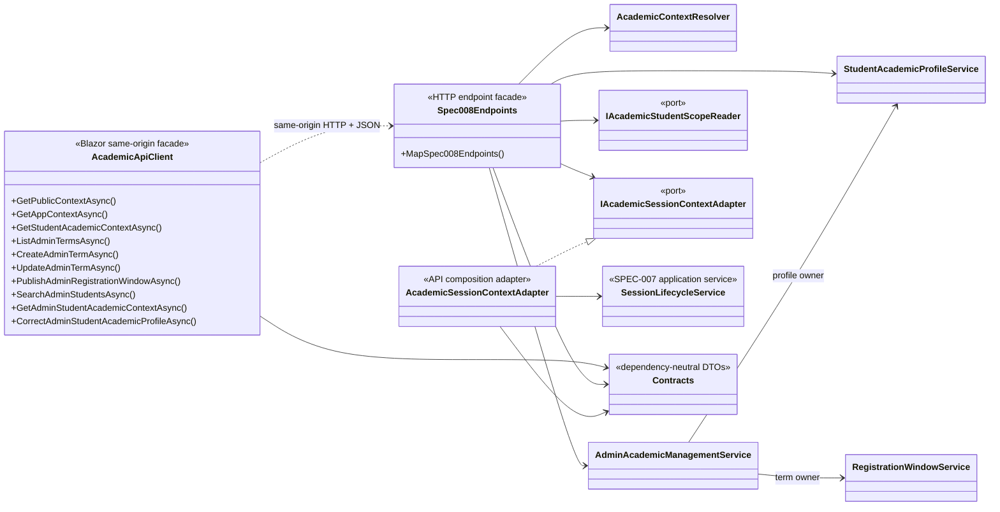
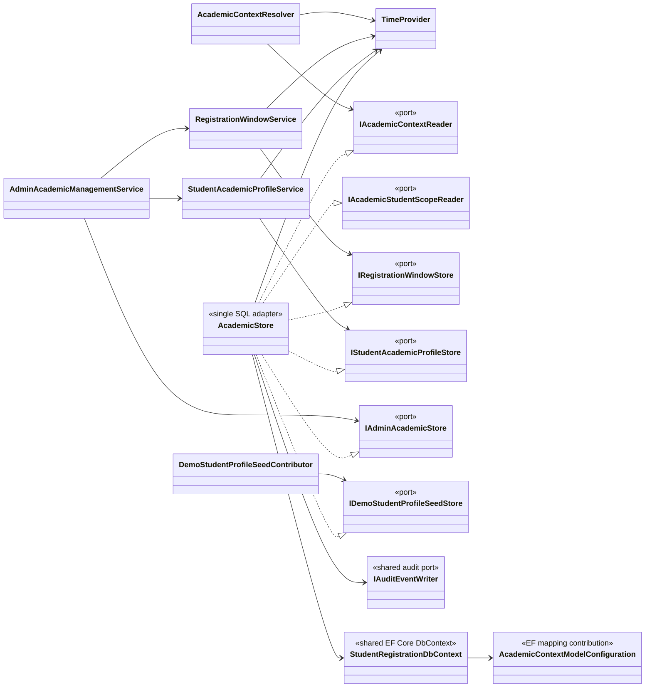
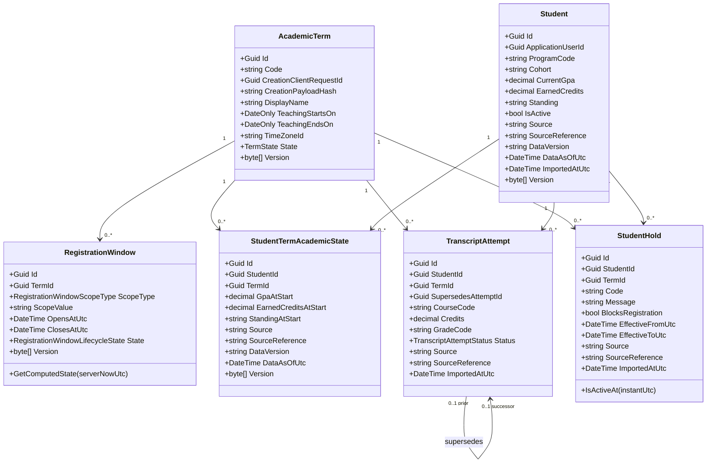

# Delivered SPEC-008 Class Diagram

This diagram documents the implemented Academic Term and Student Profile slice
inside the modular monolith. It names only delivered SPEC-008 types and their
direct collaborators. DTO field details remain in the shared Contracts project
and the feature API contract; database columns remain in the ERD and EF mapping.

## Browser, API, and application boundary



`AcademicApiClient` does transport, antiforgery-token forwarding, and bounded
response/error deserialization. It does not decide term, window, authorization,
time, GPA, hold, or concurrency outcomes. `Spec008Endpoints` applies the named
server policies and maps application outcomes to the ten HTTP contracts.
Identity-session composition stays in the API project:
`AcademicSessionContextAdapter` combines SPEC-007 session data with the
academic result through `IAcademicSessionContextAdapter`; the Academics project
does not reference the IdentityAccess implementation.

## Application services, ports, and SQL adapter



The six narrow ports are implemented by one scoped `AcademicStore`. This is a
simple adapter choice, not six repositories: the ports express consumer needs
while one SQL implementation preserves the local transaction and audit
boundary. SPEC-008 adds its mapping to the existing
`StudentRegistrationDbContext`; it does not create another DbContext,
repository base class, unit-of-work abstraction, or distributed transaction.

## Delivered domain entities



These are the exact six persisted Academics entities. `ProgramCode` and
`CourseCode` are stable sourced scalar references, not foreign keys to future
catalogue entities. `Student.ApplicationUserId` is the persistence link to the
SPEC-007 identity row, but `Student` stores only the identifier and has no
domain navigation or IdentityAccess implementation dependency. Computed
open/upcoming/closed/none window state is not a seventh entity or a persisted
lifecycle.

## Dependency direction and deliberate exclusions

```text
Blazor Client -> dependency-neutral Contracts
Blazor Client --same-origin HTTP--> HTTP endpoint facade
HTTP endpoint facade -> Academics application services and ports
API composition adapter -> Academics session-composition port + SPEC-007 service
Academics application -> Academics domain + narrow ports + TimeProvider
SQL infrastructure adapter -> Academics ports/domain + shared DbContext/audit port
```

Dependencies do not point from Domain to Application, API, Client, EF Core, SQL
Server, or IdentityAccess. There is one API host, one shared SQL database, one
`StudentRegistrationDbContext`, and local EF/SQL transactions. This delivered
SPEC-008 view intentionally contains no `CourseOffering`, `SectionGroup`,
`MeetingSlot`, optimizer, eligibility engine, seat allocator, enrollment,
registration submission, event bus, message broker, microservice, distributed
lock, second DbContext, generic repository, or extra unit of work. Those future
capabilities remain with their owning specs and are not dependencies of
SPEC-008.
