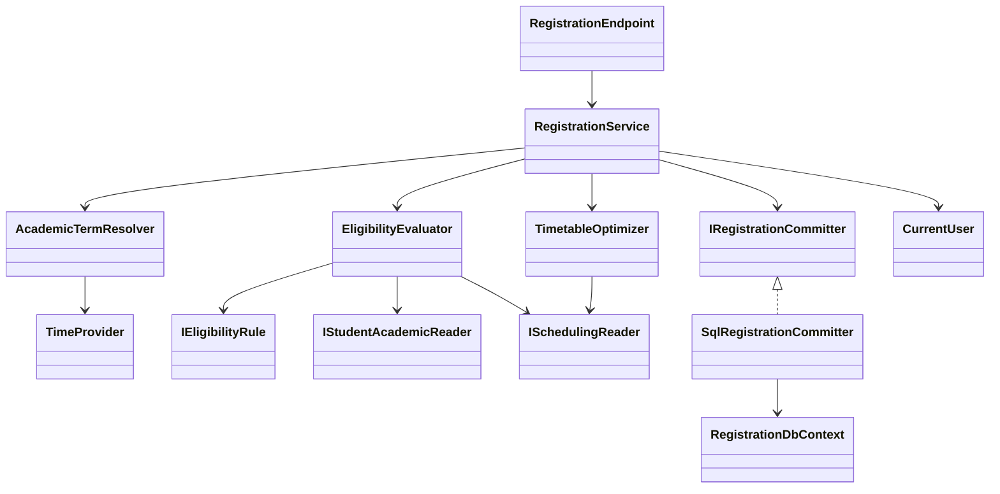
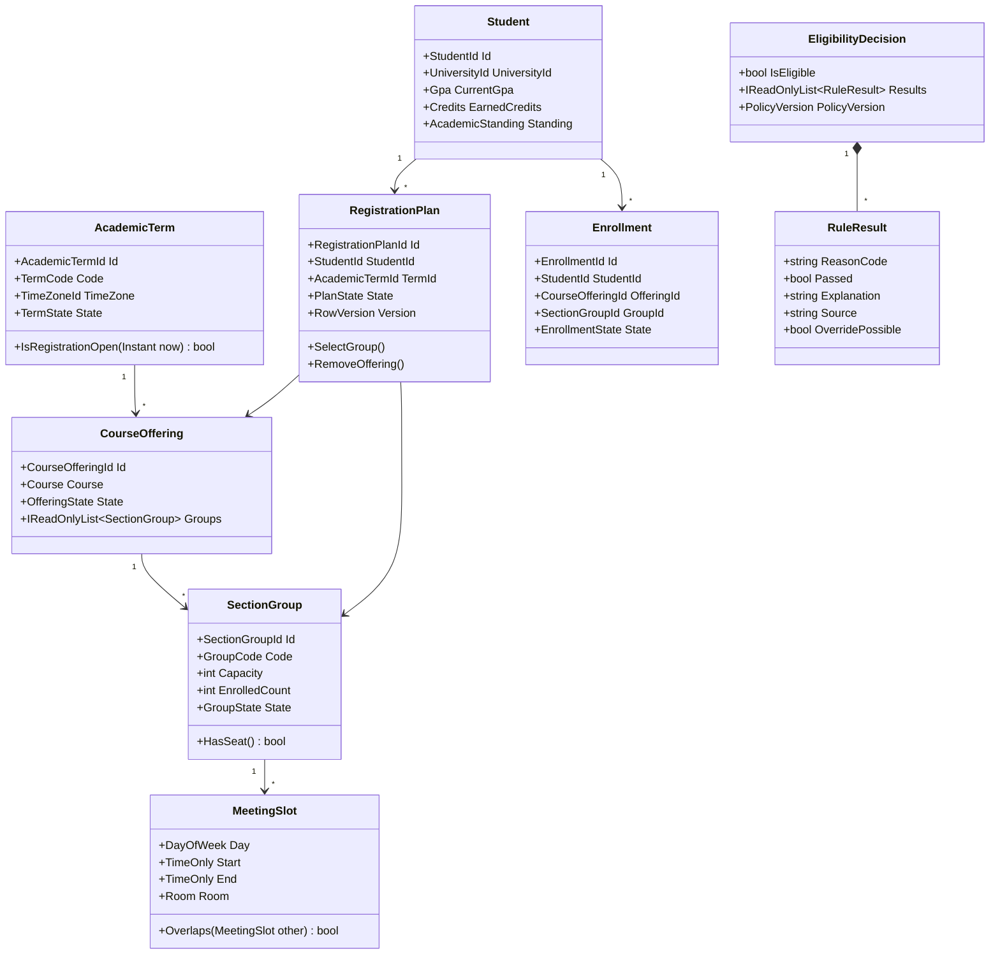

# Domain and Application Class Diagram

## Main orchestration



## Domain model



## Core interfaces

```csharp
public interface IEligibilityEvaluator
{
    Task<EligibilityDecision> EvaluateAsync(
        StudentId studentId,
        AcademicTermId termId,
        CourseOfferingId offeringId,
        CancellationToken cancellationToken);
}

public interface ITimetableOptimizer
{
    ScheduleOptimizationResult Optimize(
        IReadOnlyList<CourseChoice> courses,
        SchedulePreferences preferences,
        TimeSpan timeBudget);
}

public interface IRegistrationCommitter
{
    Task<CommitResult> TryCommitAsync(
        RegistrationCommitRequest request,
        CancellationToken cancellationToken);
}
```

These are design contracts, not implementation code. Names and signatures
remain subject to SPEC-006 approval.

## Dependency rule

Endpoints depend on application services. Application services depend on
domain types and narrow ports. Infrastructure implements ports. Domain code
does not reference ASP.NET Core, EF Core, SQL Server, Blazor, or infrastructure
projects.
