# Entity Relationship Diagram

## Core ERD

```mermaid
erDiagram
  APPLICATION_USER ||--o| STUDENT : activates
  APPLICATION_USER ||--o| STAFF : represents

  PROGRAM ||--o{ STUDENT : admits
  PROGRAM ||--o{ CURRICULUM_COURSE : defines
  COURSE ||--o{ CURRICULUM_COURSE : includes
  COURSE ||--o{ COURSE_PREREQUISITE : course
  COURSE ||--o{ COURSE_PREREQUISITE : required

  STUDENT ||--o{ TRANSCRIPT_ATTEMPT : has
  COURSE ||--o{ TRANSCRIPT_ATTEMPT : records
  ACADEMIC_TERM ||--o{ TRANSCRIPT_ATTEMPT : attempted_in
  STUDENT ||--o{ STUDENT_HOLD : may_have

  ACADEMIC_TERM ||--o{ REGISTRATION_WINDOW : exposes
  ACADEMIC_TERM ||--o{ POLICY_SET : governed_by
  PROGRAM ||--o{ POLICY_SET : specializes
  POLICY_SET ||--o{ POLICY_RULE : contains

  ACADEMIC_TERM ||--o{ COURSE_OFFERING : contains
  COURSE ||--o{ COURSE_OFFERING : offered_as
  COURSE_OFFERING ||--o{ SECTION_GROUP : has
  SECTION_GROUP ||--o{ MEETING_SLOT : meets
  ROOM ||--o{ MEETING_SLOT : hosts
  SECTION_GROUP ||--o{ GROUP_STAFF_ASSIGNMENT : taught_by
  STAFF ||--o{ GROUP_STAFF_ASSIGNMENT : assigned
  STAFF ||--o{ STAFF_TERM_AVAILABILITY : declares
  ACADEMIC_TERM ||--o{ STAFF_TERM_AVAILABILITY : scopes
  STAFF_TERM_AVAILABILITY ||--o{ STAFF_AVAILABILITY : contains

  STUDENT ||--o{ REGISTRATION_PLAN : prepares
  ACADEMIC_TERM ||--o{ REGISTRATION_PLAN : for
  REGISTRATION_PLAN ||--o{ REGISTRATION_PLAN_ITEM : contains
  COURSE_OFFERING ||--o{ REGISTRATION_PLAN_ITEM : selects
  SECTION_GROUP ||--o{ REGISTRATION_PLAN_ITEM : prefers

  STUDENT ||--o{ REGISTRATION_SUBMISSION : submits
  ACADEMIC_TERM ||--o{ REGISTRATION_SUBMISSION : for
  STUDENT ||--o{ STUDENT_TERM_REGISTRATION_GUARD : serializes
  ACADEMIC_TERM ||--o{ STUDENT_TERM_REGISTRATION_GUARD : serializes
  REGISTRATION_SUBMISSION ||--o{ ENROLLMENT : creates
  STUDENT ||--o{ ENROLLMENT : owns
  COURSE_OFFERING ||--o{ ENROLLMENT : registers
  SECTION_GROUP ||--o{ ENROLLMENT : allocates

  APPLICATION_USER ||--o{ AUDIT_EVENT : acts

  APPLICATION_USER {
    uniqueidentifier Id PK
    string UserName UK
    string NormalizedUserName UK
    bool IsEnabled
  }
  STUDENT {
    uniqueidentifier Id PK
    string UniversityId UK
    uniqueidentifier ProgramId FK
    decimal CurrentGpa
    decimal EarnedCredits
    string Standing
    rowversion Version
  }
  STAFF {
    uniqueidentifier Id PK
    string StaffNumber UK
    string DisplayName
    bool IsActive
  }
  PROGRAM {
    uniqueidentifier Id PK
    string Code UK
    string Name
  }
  COURSE {
    uniqueidentifier Id PK
    string Code UK
    string Title
    decimal Credits
    bool IsActive
  }
  CURRICULUM_COURSE {
    uniqueidentifier ProgramId PK,FK
    uniqueidentifier CourseId PK,FK
    string RequirementType
    int RecommendedTerm
  }
  COURSE_PREREQUISITE {
    uniqueidentifier CourseId PK,FK
    uniqueidentifier RequiredCourseId PK,FK
    string MinimumGrade
  }
  TRANSCRIPT_ATTEMPT {
    uniqueidentifier Id PK
    uniqueidentifier StudentId FK
    uniqueidentifier CourseId FK
    uniqueidentifier TermId FK
    string GradeCode
    decimal GradePoints
    string Status
  }
  STUDENT_HOLD {
    uniqueidentifier Id PK
    uniqueidentifier StudentId FK
    string Type
    bool BlocksRegistration
    datetime2 EffectiveFromUtc
    datetime2 EffectiveToUtc
  }
  ACADEMIC_TERM {
    uniqueidentifier Id PK
    string Code UK
    date TeachingStarts
    date TeachingEnds
    string TimeZoneId
    string State
    rowversion Version
  }
  REGISTRATION_WINDOW {
    uniqueidentifier Id PK
    uniqueidentifier TermId FK
    datetime2 OpensUtc
    datetime2 ClosesUtc
    string Audience
    rowversion Version
  }
  POLICY_SET {
    uniqueidentifier Id PK
    string Version
    uniqueidentifier TermId FK
    uniqueidentifier ProgramId FK
    string ApprovalStatus
    datetime2 EffectiveFromUtc
    rowversion VersionToken
  }
  POLICY_RULE {
    uniqueidentifier Id PK
    uniqueidentifier PolicySetId FK
    string RuleType
    string ReasonCode
    string ConfigurationJson
    string SourceUrl
  }
  COURSE_OFFERING {
    uniqueidentifier Id PK
    uniqueidentifier TermId FK
    uniqueidentifier CourseId FK
    string State
    rowversion Version
  }
  SECTION_GROUP {
    uniqueidentifier Id PK
    uniqueidentifier OfferingId FK
    string GroupCode
    int Capacity
    int EnrolledCount
    string State
    bool RegistrationPaused
    rowversion Version
  }
  MEETING_SLOT {
    uniqueidentifier Id PK
    uniqueidentifier GroupId FK
    uniqueidentifier RoomId FK
    int DayOfWeek
    time StartLocal
    time EndLocal
  }
  ROOM {
    uniqueidentifier Id PK
    string Code UK
    string Location
    int Capacity
  }
  GROUP_STAFF_ASSIGNMENT {
    uniqueidentifier GroupId PK,FK
    uniqueidentifier StaffId PK,FK
    string TeachingRole PK
  }
  STAFF_AVAILABILITY {
    uniqueidentifier Id PK
    uniqueidentifier StaffTermAvailabilityId FK
    int DayOfWeek
    time StartLocal
    time EndLocal
    string AvailabilityType
  }
  STAFF_TERM_AVAILABILITY {
    uniqueidentifier Id PK
    uniqueidentifier StaffId FK
    uniqueidentifier TermId FK
    datetime2 DeadlineUtc
    rowversion Version
  }
  REGISTRATION_PLAN {
    uniqueidentifier Id PK
    uniqueidentifier StudentId FK
    uniqueidentifier TermId FK
    string State
    rowversion Version
  }
  REGISTRATION_PLAN_ITEM {
    uniqueidentifier Id PK
    uniqueidentifier PlanId FK
    uniqueidentifier OfferingId FK
    uniqueidentifier PreferredGroupId FK
  }
  REGISTRATION_SUBMISSION {
    uniqueidentifier Id PK
    uniqueidentifier StudentId FK
    uniqueidentifier TermId FK
    uniqueidentifier ClientRequestId
    string PayloadHash
    string ProcessingState
    string ResultCode
    string DecisionSnapshotJson
    datetime2 ReceivedAtUtc
    datetime2 CompletedAtUtc
  }
  STUDENT_TERM_REGISTRATION_GUARD {
    uniqueidentifier Id PK
    uniqueidentifier StudentId FK
    uniqueidentifier TermId FK
    rowversion Version
  }
  ENROLLMENT {
    uniqueidentifier Id PK
    uniqueidentifier StudentId FK
    uniqueidentifier OfferingId FK
    uniqueidentifier GroupId FK
    uniqueidentifier SubmissionId FK
    string State
    datetime2 RegisteredAtUtc
    rowversion Version
  }
  AUDIT_EVENT {
    uniqueidentifier Id PK
    uniqueidentifier ActorUserId FK
    string Action
    string EntityType
    string EntityId
    string Reason
    datetime2 OccurredAtUtc
  }
```

## Ownership and constraints

- auth: ApplicationUser and ASP.NET Core Identity tables.
- academics: Student, Staff, Program, Course, curriculum, prerequisites,
  transcript, holds, PolicySet and PolicyRule.
- scheduling: AcademicTerm, RegistrationWindow, CourseOffering, SectionGroup,
  MeetingSlot, Room, assignments, availability.
- registration: RegistrationPlan, item, submission, Enrollment.
- audit: AuditEvent.

Required constraints/indexes:

- Unique normalized Student.UniversityId, Staff.StaffNumber, Program.Code,
  Course.Code, AcademicTerm.Code, and Room.Code.
- Unique CourseOffering(TermId, CourseId).
- Unique SectionGroup(OfferingId, GroupCode).
- Alternate key SectionGroup(Id, OfferingId), referenced by Enrollment, so a
  group cannot be paired with another offering.
- Unique Enrollment(StudentId, OfferingId); re-registration changes state on
  the same logical record.
- Unique RegistrationSubmission(StudentId, TermId, ClientRequestId).
- Unique StudentTermRegistrationGuard(StudentId, TermId).
- Unique StaffTermAvailability(StaffId, TermId).
- Unique RegistrationPlanItem(PlanId, OfferingId).
- Composite keys for curriculum, prerequisite, and staff assignment bridges.
- Check Capacity >= 0 and 0 <= EnrolledCount <= Capacity.
- Conditional seat allocation also requires SectionGroup.RegistrationPaused =
  false.
- RegistrationSubmission ProcessingState is created before the allocation
  savepoint but is never committed as a standalone in-progress record. A
  deterministic allocation rejection rolls seat/enrollment changes back to
  the savepoint, then commits the final Rejected state and payload-bound result.
- The bounded HTTP 202 response is transport retry guidance, not a persisted
  RegistrationSubmission row, and contains no SubmissionId.
- Check EndLocal > StartLocal and registration/term end > start.
- Index active enrollment by GroupId and State.
- Index transcript by StudentId/CourseId and holds by StudentId/active dates.
- Index meeting slots by GroupId/DayOfWeek/StartLocal.
- rowversion on mutable aggregate roots and admin records.
- Every group-state, MeetingSlot, room, and GroupStaffAssignment mutation locks
  and advances its owning SectionGroup.Version; child rows are never published
  without advancing that aggregate version.
- Every availability range replacement locks and advances the owning
  StaffTermAvailability.Version.

SQL constraints cannot express arbitrary overlapping time ranges. Scheduling
publication validates them transactionally and stores only a fully valid
published state.

## Data lifecycle

- No transcript attempt is overwritten.
- Enrollments retain successful registration history. Drop/withdraw/correction
  transitions are not exposed until a separate approved workflow spec exists.
- RegistrationSubmission idempotency claim, final result, decision snapshot,
  audit event, and any successful counters/enrollments commit in one SQL
  transaction. A rejected result commits only after its allocation savepoint
  has removed every seat/enrollment mutation; a Processing claim cannot be
  committed on its own.
- Published policy sets are immutable and superseded by new effective-dated
  versions.
- Decision snapshots retain the exact rule version and input summary used.
- Audit events are append-only for sensitive administrative actions.
- Retention and deletion durations require AASTMT privacy/records approval in
  SPEC-005 before production.
