# Entity Relationship Diagram

## Core ERD

```mermaid
erDiagram
  APPLICATION_USER ||--o| STUDENT : has_academic_profile
  APPLICATION_USER ||--o| STAFF : represents
  APPLICATION_USER ||--o{ ROLE_ASSIGNMENT : receives
  APPLICATION_USER ||--o{ ACCOUNT_RECOVERY_CHALLENGE : requests
  APPLICATION_USER ||--o{ SECURITY_EVENT : produces
  APPLICATION_USER ||--o{ IDENTITY_IMPORT_BATCH : requests
  APPLICATION_USER ||--o| STUDENT_ACTIVATION : is_claimed_through

  CATALOGUE_DRAFT ||--o{ IMPORT_BATCH : receives
  CATALOGUE_DRAFT ||--o| CATALOGUE_VERSION : publishes
  CATALOGUE_VERSION ||--o{ PROGRAM : snapshots
  CATALOGUE_VERSION ||--o{ COURSE : snapshots
  CATALOGUE_VERSION ||--o{ CURRICULUM_COURSE : scopes
  CATALOGUE_VERSION ||--o{ COURSE_PREREQUISITE : scopes
  PROGRAM ||--o{ CURRICULUM_COURSE : defines
  COURSE ||--o{ CURRICULUM_COURSE : includes
  COURSE ||--o{ COURSE_PREREQUISITE : course
  COURSE ||--o{ COURSE_PREREQUISITE : required

  STUDENT ||--o{ TRANSCRIPT_ATTEMPT : has
  STUDENT ||--o{ STUDENT_TERM_ACADEMIC_STATE : has
  ACADEMIC_TERM ||--o{ STUDENT_TERM_ACADEMIC_STATE : scopes
  ACADEMIC_TERM ||--o{ TRANSCRIPT_ATTEMPT : attempted_in
  STUDENT ||--o{ STUDENT_HOLD : may_have

  ACADEMIC_TERM ||--o{ REGISTRATION_WINDOW : exposes
  ACADEMIC_TERM ||--o{ POLICY_SET : governed_by
  PROGRAM ||--o{ POLICY_SET : specializes
  POLICY_SET ||--o{ POLICY_RULE : contains

  ACADEMIC_TERM ||--o{ COURSE_OFFERING : contains
  COURSE ||--o{ COURSE_OFFERING : offered_as
  COURSE_OFFERING ||--o{ SECTION_GROUP : has
  SECTION_GROUP ||--o{ MEETING_SLOT : meets
  ROOM ||--o{ MEETING_SLOT : hosts
  SECTION_GROUP ||--o{ GROUP_STAFF_ASSIGNMENT : taught_by
  STAFF ||--o{ GROUP_STAFF_ASSIGNMENT : assigned
  STAFF ||--o{ STAFF_TERM_AVAILABILITY : declares
  ACADEMIC_TERM ||--o{ STAFF_TERM_AVAILABILITY : scopes
  STAFF_TERM_AVAILABILITY ||--o{ STAFF_AVAILABILITY : contains
  STAFF_TERM_AVAILABILITY ||--o{ SCHEDULE_IMPACT_ALERT : causes
  SECTION_GROUP ||--o{ SCHEDULE_IMPACT_ALERT : affects

  STUDENT ||--o{ REGISTRATION_PLAN : prepares
  ACADEMIC_TERM ||--o{ REGISTRATION_PLAN : for
  REGISTRATION_PLAN ||--o{ REGISTRATION_PLAN_ITEM : contains
  COURSE_OFFERING ||--o{ REGISTRATION_PLAN_ITEM : selects
  SECTION_GROUP ||--o{ REGISTRATION_PLAN_ITEM : prefers

  STUDENT ||--o{ REGISTRATION_SUBMISSION : submits
  ACADEMIC_TERM ||--o{ REGISTRATION_SUBMISSION : for
  STUDENT ||--o{ STUDENT_TERM_REGISTRATION_GUARD : serializes
  ACADEMIC_TERM ||--o{ STUDENT_TERM_REGISTRATION_GUARD : serializes
  REGISTRATION_SUBMISSION ||--o{ ENROLLMENT : creates
  STUDENT ||--o{ ENROLLMENT : owns
  COURSE_OFFERING ||--o{ ENROLLMENT : registers
  SECTION_GROUP ||--o{ ENROLLMENT : allocates

  APPLICATION_USER ||--o{ EXPORT_JOB : requests

  APPLICATION_USER {
    uniqueidentifier Id PK
    string UserName UK
    string NormalizedUserName UK
    string UniversityId UK
    string PasswordHash
    bool IsEnabled
    rowversion Version
  }
  ROLE_ASSIGNMENT {
    uniqueidentifier Id PK
    uniqueidentifier UserId FK
    string RoleCode
    datetime2 EffectiveFromUtc
    datetime2 EffectiveToUtc
    rowversion Version
  }
  STUDENT_ACTIVATION {
    uniqueidentifier Id PK
    uniqueidentifier UserId FK
    datetime2 ProvisionedAtUtc
    datetime2 ActivatedAtUtc
    int FailedAttemptCount
    rowversion Version
  }
  ACCOUNT_RECOVERY_CHALLENGE {
    uniqueidentifier Id PK
    uniqueidentifier UserId FK
    string TokenHash UK
    datetime2 ExpiresAtUtc
    datetime2 ConsumedAtUtc
    rowversion Version
  }
  AUTHENTICATION_ABUSE_STATE {
    uniqueidentifier Id PK
    string SubjectKeyHash UK
    int FailureCount
    datetime2 WindowStartedAtUtc
    datetime2 LockedUntilUtc
    rowversion Version
  }
  IDENTITY_IMPORT_BATCH {
    uniqueidentifier Id PK
    uniqueidentifier RequestedByUserId FK
    string SourceName
    string SourceHash UK
    string State
    string ErrorSummaryJson
    datetime2 ImportedAtUtc
    rowversion Version
  }
  SECURITY_EVENT {
    uniqueidentifier Id PK
    uniqueidentifier UserId FK
    string EventType
    string ActorReference
    string SubjectReference
    string Reason
    string BeforeSummaryJson
    string AfterSummaryJson
    string MetadataJson
    string CorrelationId
    datetime2 OccurredAtUtc
  }
  STUDENT {
    uniqueidentifier Id PK
    uniqueidentifier ApplicationUserId FK,UK
    string ProgramCode
    decimal CurrentGpa
    decimal EarnedCredits
    string Standing
    rowversion Version
  }
  STAFF {
    uniqueidentifier Id PK
    uniqueidentifier ApplicationUserId FK,UK
    string StaffNumber UK
    string DisplayName
    bool IsActive
  }
  CATALOGUE_DRAFT {
    uniqueidentifier Id PK
    string ScopeCode
    string State
    string ContentHash
    string ContentJson
    string ValidationSummaryJson
    rowversion Version
  }
  CATALOGUE_VERSION {
    uniqueidentifier Id PK
    uniqueidentifier SourceDraftId FK,UK
    uniqueidentifier SupersedesId FK
    string VersionCode UK
    string State
    datetime2 EffectiveFromUtc
    datetime2 PublishedAtUtc
    rowversion Version
  }
  IMPORT_BATCH {
    uniqueidentifier Id PK
    uniqueidentifier CatalogueDraftId FK
    string SourceName
    string SourceHash
    string State
    string ErrorSummaryJson
    datetime2 ImportedAtUtc
  }
  PROGRAM {
    uniqueidentifier Id PK
    uniqueidentifier CatalogueVersionId FK
    string Code
    string Name
  }
  COURSE {
    uniqueidentifier Id PK
    uniqueidentifier CatalogueVersionId FK
    string Code
    string Title
    decimal Credits
    bool IsActive
  }
  CURRICULUM_COURSE {
    uniqueidentifier CatalogueVersionId PK,FK
    uniqueidentifier ProgramId PK,FK
    uniqueidentifier CourseId PK,FK
    string RequirementType
    int RecommendedTerm
  }
  COURSE_PREREQUISITE {
    uniqueidentifier CatalogueVersionId PK,FK
    uniqueidentifier CourseId PK,FK
    uniqueidentifier RequiredCourseId PK,FK
    string MinimumGrade
  }
  TRANSCRIPT_ATTEMPT {
    uniqueidentifier Id PK
    uniqueidentifier StudentId FK
    string CourseCode
    string SourceReference
    uniqueidentifier TermId FK
    string GradeCode
    decimal GradePoints
    string Status
  }
  STUDENT_TERM_ACADEMIC_STATE {
    uniqueidentifier Id PK
    uniqueidentifier StudentId FK
    uniqueidentifier TermId FK
    decimal GpaAtStart
    decimal EarnedCreditsAtStart
    string StandingAtStart
    string SourceReference
    datetime2 DataAsOfUtc
    rowversion Version
  }
  STUDENT_HOLD {
    uniqueidentifier Id PK
    uniqueidentifier StudentId FK
    string Type
    bool BlocksRegistration
    datetime2 EffectiveFromUtc
    datetime2 EffectiveToUtc
  }
  ACADEMIC_TERM {
    uniqueidentifier Id PK
    string Code UK
    date TeachingStarts
    date TeachingEnds
    string TimeZoneId
    string State
    rowversion Version
  }
  REGISTRATION_WINDOW {
    uniqueidentifier Id PK
    uniqueidentifier TermId FK
    datetime2 OpensUtc
    datetime2 ClosesUtc
    string Audience
    string State
    rowversion Version
  }
  POLICY_SET {
    uniqueidentifier Id PK
    string Version
    uniqueidentifier TermId FK
    uniqueidentifier ProgramId FK
    string ApprovalStatus
    datetime2 EffectiveFromUtc
    rowversion VersionToken
  }
  POLICY_RULE {
    uniqueidentifier Id PK
    uniqueidentifier PolicySetId FK
    string RuleType
    string ReasonCode
    string ConfigurationJson
    string SourceUrl
  }
  COURSE_OFFERING {
    uniqueidentifier Id PK
    uniqueidentifier TermId FK
    uniqueidentifier CourseId FK
    string State
    rowversion Version
  }
  SECTION_GROUP {
    uniqueidentifier Id PK
    uniqueidentifier OfferingId FK
    string GroupCode
    int Capacity
    int EnrolledCount
    string State
    bool RegistrationPaused
    rowversion Version
  }
  MEETING_SLOT {
    uniqueidentifier Id PK
    uniqueidentifier GroupId FK
    uniqueidentifier RoomId FK
    int DayOfWeek
    time StartLocal
    time EndLocal
  }
  ROOM {
    uniqueidentifier Id PK
    string Code UK
    string Location
    int Capacity
    rowversion Version
  }
  GROUP_STAFF_ASSIGNMENT {
    uniqueidentifier GroupId PK,FK
    uniqueidentifier StaffId PK,FK
    string TeachingRole PK
  }
  STAFF_AVAILABILITY {
    uniqueidentifier Id PK
    uniqueidentifier StaffTermAvailabilityId FK
    int DayOfWeek
    time StartLocal
    time EndLocal
    string AvailabilityType
  }
  STAFF_TERM_AVAILABILITY {
    uniqueidentifier Id PK
    uniqueidentifier StaffId FK
    uniqueidentifier TermId FK
    datetime2 DeadlineUtc
    rowversion Version
  }
  SCHEDULE_IMPACT_ALERT {
    uniqueidentifier Id PK
    uniqueidentifier StaffTermAvailabilityId FK
    uniqueidentifier GroupId FK
    string State
    string ReasonCode
    string LastValidationJson
    datetime2 DetectedAtUtc
    datetime2 RevalidatedAtUtc
    datetime2 ResolvedAtUtc
    rowversion Version
  }
  REGISTRATION_PLAN {
    uniqueidentifier Id PK
    uniqueidentifier StudentId FK
    uniqueidentifier TermId FK
    string State
    rowversion Version
  }
  REGISTRATION_PLAN_ITEM {
    uniqueidentifier Id PK
    uniqueidentifier PlanId FK
    uniqueidentifier OfferingId FK
    uniqueidentifier PreferredGroupId FK
  }
  REGISTRATION_SUBMISSION {
    uniqueidentifier Id PK
    uniqueidentifier StudentId FK
    uniqueidentifier TermId FK
    uniqueidentifier ClientRequestId
    string PayloadHash
    string ProcessingState
    string ResultCode
    string Reference UK
    string ReceiptSnapshotJson
    string DecisionSnapshotJson
    datetime2 ReceivedAtUtc
    datetime2 UpdatedAtUtc
    datetime2 CompletedAtUtc
  }
  STUDENT_TERM_REGISTRATION_GUARD {
    uniqueidentifier Id PK
    uniqueidentifier StudentId FK
    uniqueidentifier TermId FK
    rowversion Version
  }
  ENROLLMENT {
    uniqueidentifier Id PK
    uniqueidentifier StudentId FK
    uniqueidentifier OfferingId FK
    uniqueidentifier GroupId FK
    uniqueidentifier SubmissionId FK
    string State
    datetime2 RegisteredAtUtc
    rowversion Version
  }
  AUDIT_EVENT {
    uniqueidentifier Id PK
    string ActorReference
    string SubjectReference
    string Action
    string EntityType
    string EntityId
    string Reason
    string BeforeSummaryJson
    string AfterSummaryJson
    string CorrelationId
    datetime2 OccurredAtUtc
  }
  EXPORT_JOB {
    uniqueidentifier Id PK
    uniqueidentifier RequestedByUserId FK
    string ScopeHash
    string State
    string ResultLocation
    datetime2 ExpiresAtUtc
    string LeaseOwnerId
    datetime2 LeaseExpiresAtUtc
    int AttemptCount
    rowversion Version
  }
  ADMIN_SECURITY_GUARD {
    int Id PK
    rowversion Version
  }
```

## Ownership and constraints

- auth: ApplicationUser, Staff, role/activation/recovery/security records,
  AdminSecurityGuard, and ASP.NET Core Identity tables.
- academics: AcademicTerm, RegistrationWindow, Student and term academic state,
  Program, Course, catalogue drafts/versions/imports, curriculum,
  prerequisites, transcript, holds, PolicySet and PolicyRule.
- scheduling: CourseOffering, SectionGroup, MeetingSlot, Room, assignments,
  availability, and `ScheduleImpactAlert`.
- registration: RegistrationPlan, item, submission with receipt/reference
  snapshot, and Enrollment. RegistrationReceipt is a read projection, not a
  second table.
- audit foundation: AuditEvent is owned upstream by SPEC-004 infrastructure.
- admin reporting: ExportJob is owned by SPEC-017; it consumes AuditEvent and
  Identity-owned SecurityEvent without owning their write path.

Required constraints/indexes:

- Unique filtered normalized ApplicationUser.UniversityId for student
  identities, unique Staff.StaffNumber,
  CatalogueVersion.VersionCode, AcademicTerm.Code, and Room.Code.
- Unique Program(CatalogueVersionId, Code) and
  Course(CatalogueVersionId, Code); a published catalogue version and all of
  its program/course/curriculum rows are immutable.
- CurriculumCourse and CoursePrerequisite use composite foreign keys that
  require Program/Course members from the same CatalogueVersion; a draft
  cannot mix rows from another version.
- CatalogueDraft is mutable only while Editing or Validated. Publishing locks
  its rowversion, requires a passing validation snapshot, creates exactly one
  immutable CatalogueVersion, and never edits an existing published version.
- Unique RoleAssignment(UserId, RoleCode, EffectiveFromUtc),
  StudentActivation(UserId), AccountRecoveryChallenge(TokenHash),
  AuthenticationAbuseState(SubjectKeyHash), and IdentityImportBatch(SourceHash).
- Unique CourseOffering(TermId, CourseId).
- Unique SectionGroup(OfferingId, GroupCode).
- Alternate key SectionGroup(Id, OfferingId), referenced by Enrollment, so a
  group cannot be paired with another offering.
- Unique Enrollment(StudentId, OfferingId); re-registration changes state on
  the same logical record.
- Unique RegistrationSubmission(StudentId, TermId, ClientRequestId).
- Unique non-null RegistrationSubmission.Reference; it and
  ReceiptSnapshotJson exist only for an accepted final submission.
- Unique StudentTermRegistrationGuard(StudentId, TermId).
- Unique StudentTermAcademicState(StudentId, TermId).
- Unique StaffTermAvailability(StaffId, TermId).
- Unique RegistrationPlanItem(PlanId, OfferingId).
- Composite keys for curriculum, prerequisite, and staff assignment bridges.
- Check Capacity >= 0 and 0 <= EnrolledCount <= Capacity.
- Conditional seat allocation also requires SectionGroup.RegistrationPaused =
  false.
- RegistrationSubmission ProcessingState is created before the allocation
  savepoint but is never committed as a standalone in-progress record. A
  deterministic allocation rejection rolls seat/enrollment changes back to
  the savepoint, then commits the final Rejected state and payload-bound result.
- The bounded HTTP 202 response is transport retry guidance, not a persisted
  RegistrationSubmission row, and contains no SubmissionId.
- Check EndLocal > StartLocal and registration/term end > start.
- RegistrationWindow.State is Draft, Open, Closed, or Cancelled and only one
  applicable Open window may govern a student at an instant.
- Index active enrollment by GroupId and State.
- Index transcript by StudentId/CourseCode and holds by StudentId/active dates.
- Index meeting slots by GroupId/DayOfWeek/StartLocal.
- rowversion on mutable aggregate roots and admin records.
- Every group-state, MeetingSlot, room, and GroupStaffAssignment mutation locks
  and advances its owning SectionGroup.Version; child rows are never published
  without advancing that aggregate version.
- Every availability range replacement locks and advances the owning
  StaffTermAvailability.Version.
- Scheduling owns StaffTermAvailability and StaffAvailability. The staff
  workspace edits that aggregate through a Scheduling application port;
  changing availability never transfers ownership to StaffAdministration.
- Required staff assignments are policy-driven by activity type. Lecture
  activity requires at least one Lecturer; tutorial/laboratory activity
  requires at least one Teaching Assistant. A composite registration option
  displays every assigned Lecturer and Teaching Assistant, and publication
  fails when its activity requirement is not met.
- RegistrationReceipt is projected from the accepted submission's atomic
  Reference and ReceiptSnapshotJson. It has no second table or write path;
  rejections have neither field.
- ExportJob claims use a compare-and-set rowversion plus expiring lease so only
  one replica produces a result. Lease recovery is idempotent.
- Every final-Admin role mutation is owned by SPEC-007 IdentityAccess, locks
  the singleton AdminSecurityGuard, rechecks the enabled-Admin count, and
  writes SecurityEvent plus the shared AuditEvent inside the same transaction.

SQL constraints cannot express arbitrary overlapping time ranges. Scheduling
publication validates them transactionally and stores only a fully valid
published state.

## Data lifecycle

- No transcript attempt is overwritten.
- Enrollments retain successful registration history. Drop/withdraw/correction
  transitions are not exposed until a separate approved workflow spec exists.
- RegistrationSubmission idempotency claim, final result, decision snapshot,
  audit event, and any successful counters/enrollments commit in one SQL
  transaction. A rejected result commits only after its allocation savepoint
  has removed every seat/enrollment mutation; a Processing claim cannot be
  committed on its own.
- Published policy sets are immutable and superseded by new effective-dated
  versions.
- Published catalogue versions are immutable; imports create or replace only a
  draft and a later publication supersedes rather than edits a published
  version.
- Decision snapshots retain the exact rule version and input summary used.
- Audit events are append-only for sensitive administrative actions.
- Account recovery challenges store only a token hash and are atomically
  consumed once; expired challenge material is removed by the demo lifecycle.
- Git-ignored local export, log, and generated-credential artifacts expire and
  are deleted within seven days. Per-run Testing databases are disposed after
  use; Development academic/audit/idempotency rows persist until explicit
  guarded reset.
- These durations apply only to wholly synthetic POC data. Real-data and
  production retention require a future AASTMT privacy/records decision.
